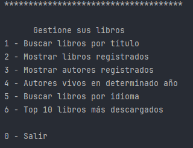

<div style="position: relative; display: inline-block; text-align: center;">
    
    <div style="position: absolute; top: 50%; left: 50%; transform: translate(-50%, -50%);
         color: white; font-size: 30px; font-weight: bold; background-color: rgba(0, 0, 0, 0.5); 
         padding: 10px; font-family: 'Italic', sans-serif;font-style: oblique;">
      <h3 align="center"> Challenge Literatura Alura </h3> 
    </div>
</div>

# Literalura 

## Challenge Literalura
Es una aplicación de consola desarrollada en Java que permite buscar y listar libros consumiento API Gutendex con el fin de almacenar en una base de datos en este caso Postgresql

## 🔨 Funcionalidades del proyecto

Menu de opciones



1. **Buscar libro por título**: Busqueda de libro por su título y almacena en la base de datos local.
2. **Listar libros registrados**: Muestra todos los libros que han sido registrados en la base de datos.
3. **Listar autores registrados**: Muestra todos los autores que han sido registrados en la base de datos.
4. **Listar autores vivos en un determinado año**: Permite listar los autores que estaban vivos en un año específico.
5. **Listar libros por idioma**: Permite listar los libros por su idioma (ES, EN, FR, PT).
6. **Top 10 libros más descargados**: Muestra los 10 libros más descargados.

## Requisitos

- IDE Java
- Spring Boot 3.2.4
- PostgreSQL
- Maven

## 📂 Acceso al proyecto:

1. 💿 Clone el repositorio url :
```
https://github.com/LuGutierrez29/Literalura
```
2. :accessibility: Inicialize su IDE de preferencia y agregue el proyecto.
2. 🏃 inicie el main del proyecto

## Uso

Inicialice la aplicación e interactue con el menu.

## Autores
| [<br><sub>Luis Alejandro Gutierrez Diaz</sub>](https://github.com/LuGutierrez29) |  
| :---: |
